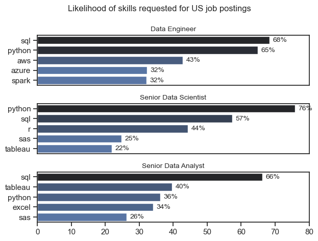
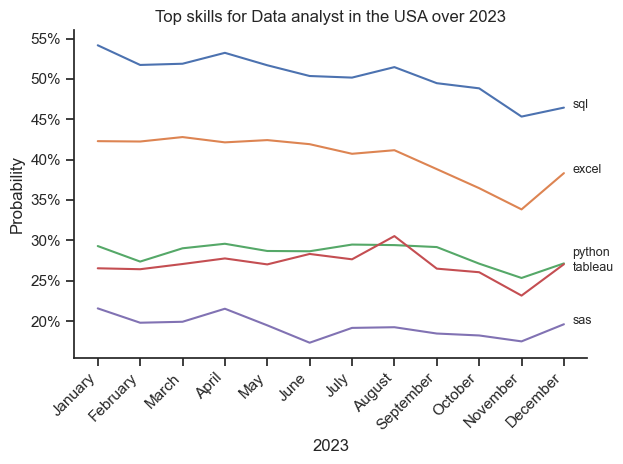
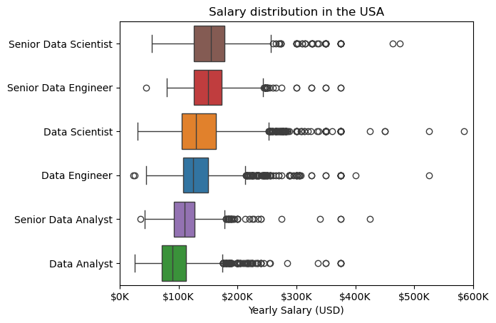
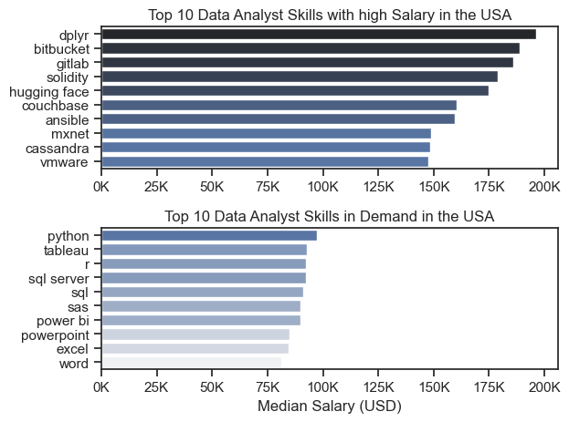
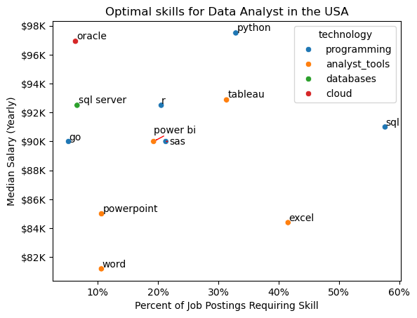

# Introduction

This project is a practical application of data analysis and Python programming, developed as a culmination of skills learned. It focuses on extracting meaningful insights from a [real-world dataset](https://huggingface.co/datasets/lukebarousse/data_jobs) , moving from data cleaning and exploration to visualization and clear reporting.

# Questions

1. What are the most demanded skills for the top 3 data roles?

2. How have the top skills for Data Analysts evolved over the course of 2023?

3. What is the salary distribution for key data roles in the USA?

4. Which skills for Data Analysts command the highest salaries, and how do they compare to the most frequently demanded skills?

5. What are the optimal skills for a Data Analyst to learn, balancing high salary potential with high market demand?


# The analysis

## Most demanded skills for the top 3 data roles

To find the most demanded skills for the top 3 most popular data roles. I filtered out the job positions with the most advitised. At the same time, i got the top 5 skills recommanded for top 3 jobs position.

View my notebook with detailed stps here:
[2_skil_Demand.ipynb](4_Project/2_skills_Demand.ipynb)

### Data Visualization

fig, ax = plt.subplots(3,1)
sns.set_theme(style = 'ticks')

```python
for i, job_title in  enumerate (job_titles):
    df_yo = df_skills_perc[df_skills_perc['job_title_short'] == job_title].sort_values(by = 'count', ascending = False).head(5)
    #df_yo.plot(kind = 'barh', x = 'job_skills', y = 'skill_perc',ax = ax[i], title = job_title, legend = False)
    sns.barplot(data = df_yo, x = 'skill_perc', y = 'job_skills', ax =ax[i], hue = 'count', palette = 'dark:b_r')
    ax[i].set_ylabel('')
    ax[i].set_xlabel('')
    ax[i].get_legend().remove()
    ax[i].set_title(job_title, fontsize = 10)
    ax[i].set_xlim(0, 80)
    
    for n,v in enumerate(df_yo['skill_perc']):
        ax[i].text(v + 1, n, f'{v:.0f}%', va = 'center', fontsize = 10)

    if i != 2:
        ax[i].set_xticks([])
    
plt.suptitle('Likelihood of skills requested for US job postings', fontsize = 12)
plt.tight_layout()
plt.show()

```

### Results



### Insights

Based on the figure, here are the key insights on top skill demands for US data roles:

1. #### Universal Must-Haves
  -  SQL is top-3 for all roles (#1 for Data Engineer & Senior Data Analyst)
  - Python is equally critical (#1 for Senior Data Scientist, top-3 for all)

2. #### Role Specialization
  - Data Engineer: Cloud (AWS, Azure) & big data (Spark)
  - Senior Data Scientist: Statistical tools (R, SAS) & visualization (Tableau)
  - Senior Data Analyst: BI tools (Tableau, Excel) & some SAS

3. #### Key Patterns
  - Python is the single most demanded skill (76% for Data Scientists)

  - Cloud skills are almost exclusive to Data Engineers

  - Tableau is important for analytical roles but not engineering

  - Legacy tools (SAS, R) still matter for senior positions

4. #### Career Insight:
  - Master SQL + Python as your foundation, then specialize:

  - Engineering: Add cloud (AWS/Azure) and Spark

  - Data Science: Add R and visualization

  - Analysis: Add Tableau and business tools

## 2 - Skill trend for Data Analyst

view details here :
[skill trends](4_Project/3_Skill_Trend.ipynb)

### Data Visualization

```python
df_line = df_DA_US_perc.iloc[:,:5]
sns.lineplot(data = df_line, dashes = False)
sns.set_theme(style = 'ticks')
sns.despine()

plt.xticks(rotation = 45, ha = 'right')
plt.title('Top skills for Data analyst in the USA over 2023')
plt.ylabel('Probability')
plt.xlabel('2023')
plt.legend().remove()

from matplotlib.ticker import PercentFormatter
ax = plt.gca() 
ax.yaxis.set_major_formatter(PercentFormatter(decimals = 0))

for i in range(5):
    y_pos = df_line.iloc[-1, i]
    if df_line.columns[i] == 'python':
        y_pos += 1  
    elif df_line.columns[i] == 'tableau':
        y_pos -= 1
    plt.text(11.2, y_pos, df_line.columns[i], fontsize = 9)

plt.tight_layout()
```

### Results



### Insights

1. SQL is the most in-demand skill throughout the year, though it shows a gradual decline toward the end of 2023.

2. Excel remains consistently important, with a notable drop in the last quarter, then a rebound in December.

3. ython and Tableau show moderate and fairly stable demand, peaking slightly mid-year (around August).

4. SAS is the least demanded skill overall, with relatively low and stable usage.

Overall, core data skills remain steady, but there is a slight softening in demand toward late 2023, especially for SQL and Excel.


## 3 - a. Salary for data roles

view details here :
[Salary for Data roles](4_Project/4_Salary_analysis.ipynb)

### Data Visualization
```python
sns.boxplot(data=df_US_top, x = 'salary_year_avg', y = 'job_title_short', hue = 'job_title_short', order = job_ranking)
plt.title('Salary distribution in the USA')
plt.xlabel('Yearly Salary (USD)')
plt.ylabel('')
ax = plt.gca()
ax.xaxis.set_major_formatter(plt.FuncFormatter(lambda x, pos: f'${int(x/1000)}K'))
plt.xlim(0,600000)
plt.show()
```



### Insights

1. Engineering roles tend to pay more than analytics roles

Data Engineers and Senior Data Engineers earn more than their Data Analyst counterparts at similar seniority levels.

2. Seniority brings a significant salary bump

Senior positions (e.g., Senior Data Scientist vs. Data Scientist) show a clear and substantial increase in compensation.

3. Data Scientist roles are among the highest paid

Senior Data Scientist has the highest shown salary range, reflecting strong demand for advanced analytical and ML expertise.

4. Salary ranges are wide within roles

Most positions show broad pay bands, indicating variability by location, industry, experience, and company size.

5. Entry-level roles start near $100K

Even non-senior roles like Data Analyst and Data Engineer appear to begin around or above $100K, highlighting the high market value of data professionals in the U.S.


## 3. b. Highest pay and most demanded skills for Data Analyst

### Data Visualization

```python
fig, ax = plt.subplots(2,1)

sns.set_theme(style = 'ticks')

sns.barplot(data = df_DA_top_pay, x = 'median', y = df_DA_top_pay.index, ax = ax[0], hue = 'median', palette = 'dark:b_r', legend = False)
#df_DA_top_pay.plot(kind = 'barh', y = 'median_salary', ax = ax[0], legend =False)
#ax[0].invert_yaxis()
ax[0].set_title('Top 10 Data Analyst Skills with high Salary in the USA')
ax[0].set_ylabel('')
ax[0].set_xlabel('')
ax[0].xaxis.set_major_formatter(plt.FuncFormatter(lambda x, pos: f'{int(x/1000)}K'))

sns.barplot(data = df_DA_top_skills, x = 'median', y = df_DA_top_skills.index, ax = ax[1], hue = 'median', palette = 'light:b', legend = False)


#df_DA_top_skill.plot(kind = 'barh', y = 'median_salary', ax = ax[1], legend =False)
#ax[1].invert_yaxis()
ax[1].set_xlim(ax[0].get_xlim())
ax[1].set_title('Top 10 Data Analyst Skills in Demand in the USA')
ax[1].set_ylabel('')
ax[1].set_xlabel('Median Salary (USD)')
ax[1].xaxis.set_major_formatter(plt.FuncFormatter(lambda x, pos: f'{int(x/1000)}K'))

plt.tight_layout()
plt.show()
```



### Insights
1. High-salary skills

- Niche and advanced skills (e.g. dplyr, Git tools, blockchain, AI platforms, databases, DevOps) command very high salaries.

- These skills are less common among data analysts, which explains the salary premium.

- High pay here reflects specialization and cross-disciplinary expertise, not core analyst skills.

2. In-demand skills

- Python, SQL, Tableau, Power BI, Excel dominate demand.

- These are core, baseline skills expected for most data analyst roles.

- Salaries are solid but lower than niche skills, due to widespread adoption.

Overall takeaway:
Demand ≠ highest salary: common skills get you hired; rare skills boost pay.

The best strategy is to master core skills (Python + SQL + BI tools), then add one or two niche/high-value skills to stand out and increase earning potential.

## 4 - Optimal skills to learn

View details here
[Optimal skills](4_Project/5_Optimal_skills.ipynb)

### Data visualization

```python
sns.scatterplot(
   data = df_plot,
   x = 'skill_percent',
   y = 'median_salary',
   hue = 'technology'
)
tests = []
for i, row in enumerate(df_DA_skills_top.index):
   tests.append(plt.text(df_DA_skills_top['skill_percent'].iloc[i], df_DA_skills_top['median_salary'].iloc[i], row))
adjust_text(tests, arrowprops=dict(arrowstyle='->', color='red'))

from matplotlib.ticker import PercentFormatter
ax = plt.gca()
ax.yaxis.set_major_formatter(plt.FuncFormatter(lambda y, pos: f'${int(y/1000)}K'))
ax.xaxis.set_major_formatter(PercentFormatter(decimals = 0))

plt.title('Optimal skills for Data Analyst in the USA')
plt.xlabel('Percent of Job Postings Requiring Skill')
plt.ylabel('Median Salary (Yearly)')
plt.show()
```

### Results



### Insights

1. SQL is the most in-demand skill (highest % of job postings) with a strong median salary, making it a must-have.

2. Python stands out as a high-paying skill with solid demand, offering strong career leverage.

3. Cloud and database skills (Oracle, SQL Server) are associated with higher salaries, even with lower demand.

4. BI & analytics tools (Tableau, Power BI) offer good salary potential with moderate demand.

5. Basic office tools (Excel, Word, PowerPoint) have high usage but lower salary impact, indicating they are baseline rather than differentiating skills.

Overall takeaway:
To maximize value as a data analyst in the USA, combine SQL + Python with at least one BI tool and one database/cloud skill.

# Key insights

SQL and Python are foundational across all top data roles, but specialization drives salary. Data Engineers focus on cloud platforms, Data Scientists on statistical tools, and Analysts on BI software. Seniority significantly boosts pay, with engineering roles commanding the highest compensation. For Data Analysts, combining high-demand skills like SQL with niche expertise like cloud databases offers the best salary potential.

# Conclusion

This project provided hands-on experience performing an end-to-end data analysis, from loading and cleaning real-world job data to uncovering actionable insights about skills and salaries. I strengthened my proficiency in Python, Pandas, and Seaborn while learning to communicate findings through clear visualizations and structured reporting. Completing this work has given me practical confidence in transforming raw data into strategic, career-relevant recommendations.